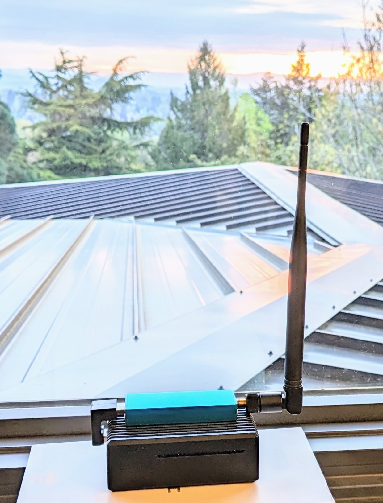
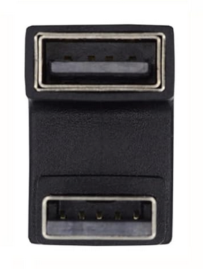

# Supported Hardware

---

:fontawesome-brands-youtube:{ style="color: #EE0F0F" }
__[Building an ADS B Feeder]__ – :octicons-clock-24:
6m – Learn how to build a simple ADS-B feeder, including all of the components for a basic indoor feeder.

[Building an ADS B Feeder]: https://www.youtube.com/watch?v=PKQBfQD1C5M

---

## Supported Single Board Computers

**Most importantly**: you need a decent power supply.  
No, not a USB charger – an actual power supply designed for a single board computer.  
For most RPi3 class boards you can get away with a 5V/2.5A supply. For anything more powerful, I recommend a 5V/4A supply.

**Boards that are actively tested and should work:**

- Raspberry Pi 4 or Pi 5 (the Pi 5 is overkill; a Pi 4 with 1G RAM will do just fine)
- Orange Pi Zero3 (currently my favorite in terms of price/performance) – but for just a little more money you can get a 1GB Pi4 which is still preferable
- Raspberry Pi Zero 2 W, Pi Model 3 A+/B(+)  
  *Note: a Raspberry Pi Zero W will **NOT** work; these models may exhibit MLAT instability, so if possible, go with another option.*
- Libre Computer Le Potato
- Orange Pi 3 LTS (no WiFi support), 4 LTS, 5, and 5 Plus (all known to work, though not tested regularly)
- Nano Pi NEO 3
- Odroid C4 and Odroid xu4 (not tested by the developers but in active use)
- Various flavors of x86-64 VMs as well as an x86-64 native .ISO that can be installed on any x86-64 system.

Additionally, the software stack can be installed on any board that supports DietPi or on most Debian/Ubuntu Linux systems.  
*Note: Installing the adsb.im software in a VM is known to cause MLAT issues when the USB SDR is passed through.*

---

## Supported Software Defined Radios (SDRs)

- Airspy Mini (expensive, but by far the best supported SDR for ADS‑B/1090MHz)
- NoName Chinese 1090MHz SDR (directly from AliExpress, also available in branded versions like airplanes.live, airframes.io, ADSBexchange)  
  *A fairly good RTL SDR with a 1090MHz filter and low noise amplifier in a blue metal housing – excellent for heat dissipation and longevity.*
- Rtl-Sdr.com v3 and v4 dongles (v3 is slightly better suited for ADS‑B use cases)
- FlightAware pro stick (includes a 1090MHz filter and low noise amplifier – though its plastic housing makes it less preferable than some alternatives)
- RadarBox green stick (includes a 1090MHz filter and low noise amplifier – appears slightly lower quality than the above options)
- RadarBox red stick (includes a 978MHz filter and low noise amplifier for UAT978)
- Nooelec NESDR SMArt and SMArTee
- Most other RTL2838-based USB sticks should work
- SDRplay RSP1a and RSP1b (other models might also work)

---

## Antennas

- Best results come from an outdoor antenna mounted as high as possible (for maximum horizon visibility).
- [Matthias Wirth's wiki](https://github.com/wiedehopf/adsb-wiki/wiki/adsb-receiver-shopping-list#antenna-choices) offers a great summary of various antenna options.

---

## Filters and LNAs (Low Noise Amplifiers)

- Some recommended SDRs already include a filter and LNA.
- When investing in an Airspy Mini and a good outdoor antenna, a filtered LNA is a very useful addition.  
  See [Matthias' wiki](https://github.com/wiedehopf/adsb-wiki/wiki/adsb-receiver-shopping-list#high-performance-sdr--lna-combo) for more details.
- A cavity filter (the gold standard for filtering) makes a significant difference in very noisy environments.  
  *(None of the integrated SDRs include a cavity filter – those are generally quite large.)*

---

## SD Cards (well, technically µSD cards)

- The software fits on an 8GB card, but it’s generally better to use a larger card to extend its useful life.  
  A larger card balances the writes across more flash cells, which have limited write cycles.  
  Even though the stack tries to reduce unnecessary writes, 8GB cards tend to fail sooner.
- Ideally, use a class 10 card from a reputable brand (e.g., SanDisk Ultra).
- Avoid cards that seem too inexpensive.
- For most feeders, I use 64GB SanDisk Extreme cards – though many have had good experiences with SanDisk Industrial or Samsung High Endurance cards.

# Sample hardware setups

The goal of this page is to collect some "known good" configurations for people looking for ideas on how to set up their feeders. Obviously these aren't the only ones that work – they are just examples that work for me (and hopefully we'll get some contributions to add more).

## RPi4 Passive Indoor Setup

<figure markdown="span">
    { width="300" align=left}
    <figcaption>Passively Cooled Indoor Setup</figcaption>
</figure>

This one is really neat to give to people who wouldn't want to have something that looks too "hacky" (and doesn't require any outdoor access, drilling, mounting, etc.).

**Parts (with possible sources – none of these are affiliate links):**

- **Raspberry Pi 4**  
  [Adafruit](https://www.adafruit.com/product/4295) · [PiShop.us](https://www.pishop.us/product/raspberry-pi-4-model-b-1gb)
- **Raspberry Pi 4 compatible power supply**  
  [Adafruit](https://www.adafruit.com/product/4298) · [PiShop.us](https://www.pishop.us/product/usb-c-power-supply-5-1v-3-0a-black-ul-listed/)
- **Geekworm for Raspberry Pi 4 Aluminum Case**  
  [Geekworm](https://geekworm.com/products/raspberry-pi-4-heavy-duty-aluminum-passive-cooling-metal-case) · [Amazon](https://www.amazon.com/gp/product/B07ZVJDRF3)
- **Icarus/adsbX SDR / antenna / SDcard bundle**  
  [Amazon](https://www.amazon.com/dp/B09F2ND4R6)  
  *Note: It's ironic to recommend this one and tell you to overwrite the SDcard with the adsb.im image, but actually I don't recommend using just an 8GB SDcard – even though it does work.*
- **USB-A U-Shaped "Down" Adapter**  
  [Amazon](https://www.amazon.com/gp/product/B0C2CQGMLG)

The somewhat hard-to-find USB U-Shaped "Down" adapter makes this setup so nice – it positions the metal housing of the SDR stick right above the metal case, making the whole setup more compact and less fragile. Please note that these adapters come in two orientations, so be sure to get the one that looks like the image below.

<figure markdown="span">
    {: style="max-height: 5em;" }
    <figcaption>USB-U-down</figcaption>
</figure>
