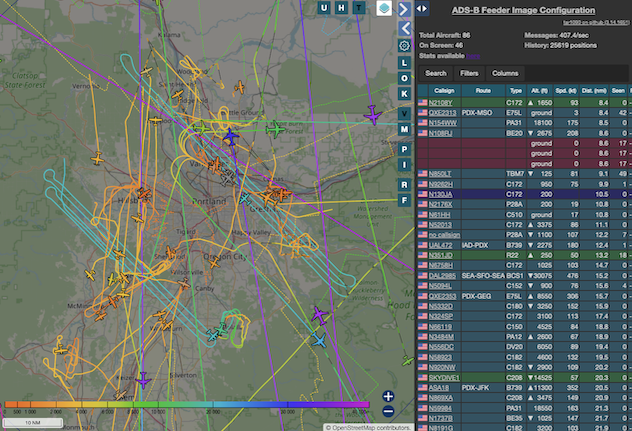
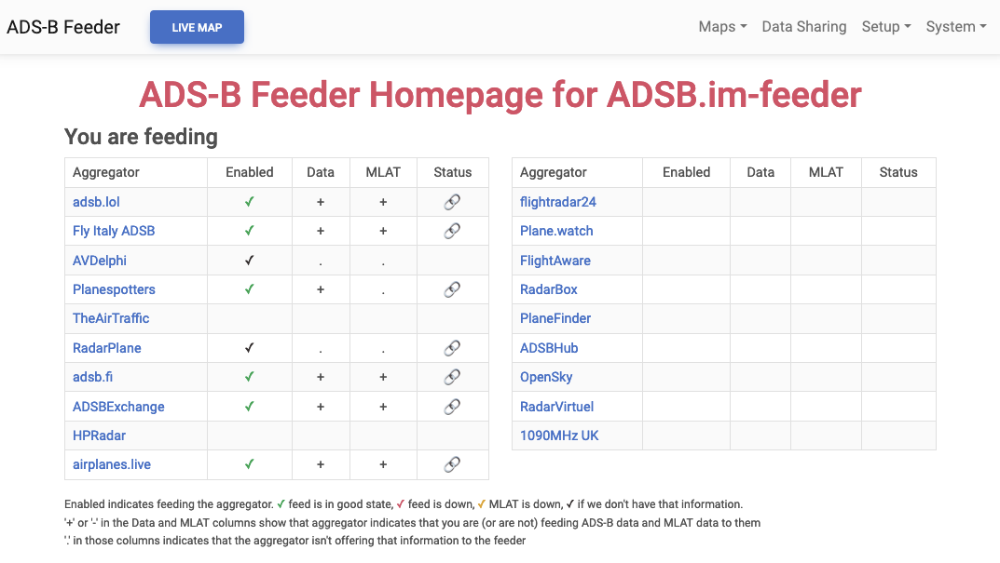
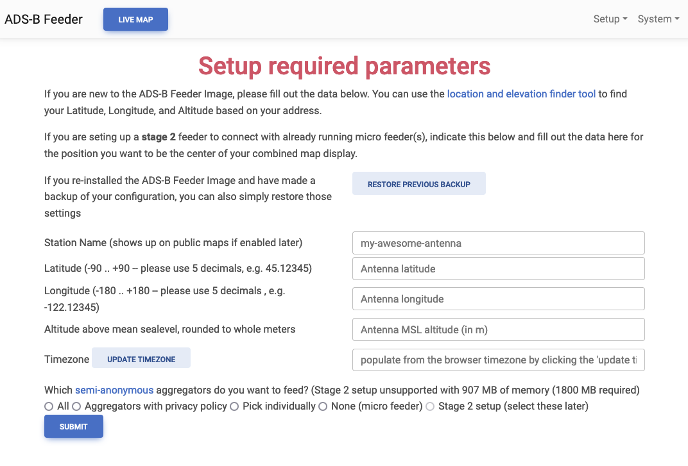
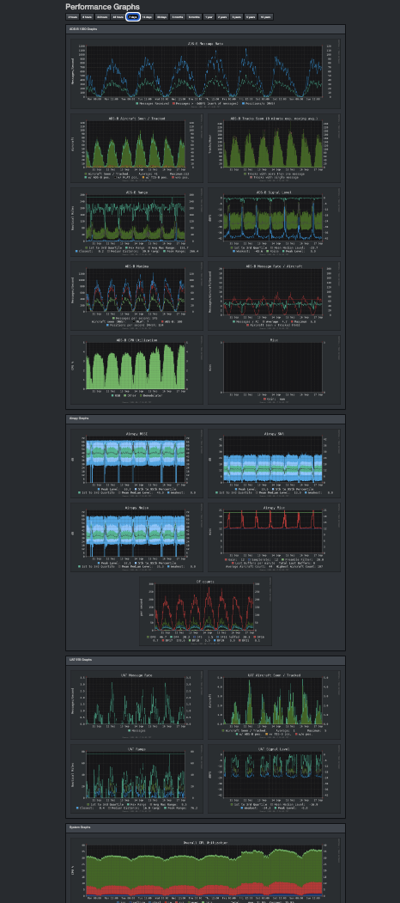

# ADSB.im

<p style="font-size: 2em;">
  The easiest way to track nearby aircraft with your own hardware and share with others
</p>

## Introduction

<iframe width="560" height="315" src="https://www.youtube-nocookie.com/embed/fMH5HxiRj78?si=rppsYoJ4fuMA0sXQ" title="YouTube video player" frameborder="0" allow="accelerometer; autoplay; clipboard-write; encrypted-media; gyroscope; picture-in-picture; web-share" referrerpolicy="strict-origin-when-cross-origin" allowfullscreen></iframe>

{ align=left }

The image above shows the planes above me right now, their recent tracks and extra details like altitude, speed, and—for many commercial flights—the flight route.

Plot aircraft on your own map, and share to aggregators like [adsb.lol](https://adsb.lol/), [Fly Italy Adsb](https://flyitalyadsb.com/), [TheAirTraffic](http://theairtraffic.com/), [adsb.fi](https://adsb.fi/), [ADS-B Exchange](https://adsbexchange.com/), [ADSBHub](https://adsbhub.org/), [ADS-B One](https://adsb.one/), [airplanes.live](https://airplanes.live), [AVDelphi](https://www.avdelphi.com/), [FlightAware](https://flightaware.com/), [FlightRadar24](https://www.flightradar24.com/), [FLYOVR.io](https://www.flyovr.io/), [OpenSky Network](https://opensky-network.org/), [Plane.watch](https://plane.watch/), [Plane Finder](https://planefinder.net/), [Planespotters.net](http://planespotters.net/), [AirNav Radar](https://www.airnavradar.com/), [RadarPlane](https://radarplane.com/), [Radar Virtuel](https://www.radarvirtuel.com/) and more!

---

There are several ways to use the ADS-B Feeder Image, depending on where and how you want to run things. When in doubt, the SBC Image should always be your first choice—it’s the most tested, easiest to use, and has the fewest pitfalls.

## Installing

=== "SBC Image (easiest)"

    - Start with one of the [supported SBC's](hardware.md#supported-single-board-computers).
    - Add an [SDR radio dongle](hardware.md#supported-software-defined-radios-sdrs) and an [antenna](hardware.md#antennas).
    - [Download](download.md) the matching SD-card image and write it to an [SD-card](hardware.md#sd-cards-well-technically-sd-cards).
    - Boot your SBC and wait a little while (depending on the model and the specific image this usually takes a few minutes, though it can sometimes take 15 to 20 minutes).
    - If you have wired Ethernet—or have managed to configure WiFi using your image writing software (available only for the Raspberry Pi image that isn’t DietPi based, and even there this capability is rumored to disappear)—simply go to [http://adsb-feeder.local](http://adsb-feeder.local) or (if mDNS isn’t working on your network) to [http://my.adsb.im](http://my.adsb.im), which should redirect you to your new ADS-B feeder.
    - If you plan to use WiFi and couldn’t configure it while writing the SD card, the image will create a WiFi hotspot named `adsb.im-feeder` so you can connect and enter your WiFi credentials. More details can be found on our [Hotspot Page](hotspot.md).

    A full walkthrough of the process with more detailed instructions is available on the [HowTo Page](howto.md).

=== "DietPi (easy)"

    - On current versions of DietPi, simply use `dietpi-software` and search for app number 141 (or for ADS-B Feeder).
    - After installation, connect to the web UI via:  
    `http://{local name or IP}:1099`
    - You’ll still need a [supported SDR](hardware.md#supported-software-defined-radios-sdrs) and an [antenna](hardware.md#antennas) connected to your DietPi system.

=== "Linux (more advanced)"

    - On recent Debian/Ubuntu-based Linux systems (ARM64 or x86), you can install the ADS-B Feeder Image as an app.
    - Run the following command to install directly:

    ```bash
    curl https://raw.githubusercontent.com/dirkhh/adsb-feeder-image/main/src/tools/app-install.sh | sudo bash
    ```

## Screenshots

=== "Dashboard"
    
    

=== "Basic Setup"

    

=== "Stats"

    

---

## Once you are up and running with the web UI

The first page the Feeder will show you is the basic setup page. Here you can:

- Give your feeder station a name (used for the map website and aggregator MLAT graphs).
- Enter the physical location of the antenna (there is a link to a useful tool if you need help finding the correct latitude, longitude, and elevation).
- Enter the time zone (again, there's a button to make this straight forward).
- Select the initial set of aggregators you want to send data to.
- Click on **Setup** — unless you decided to manually select aggregators or have multiple SDRs or some other unusual circumstances, this is all it takes to get started. Next, the web UI will redirect you to the ADS-B Feeder home page where you can manage your feeder station.

For those who prefer this format, we even have a [short video](https://youtu.be/N5yHvInpDBM) that shows the steps described above.

## For help, questions, or to see the source code

- [Feeder Image Zulip channel](https://adsblol.zulipchat.com/#narrow/stream/391168-adsb-feeder-image) on adsb.lol's Zulip server.
- `#adsb-dot-im` channel on the [SDR-Enthusiast Discord server](https://discord.gg/vqvJXRAkJ4).
- [Feeder Image GitHub project](https://github.com/dirkhh/adsb-feeder-image).